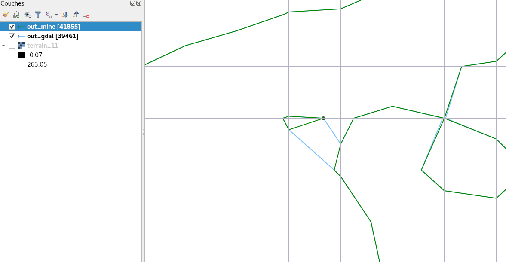
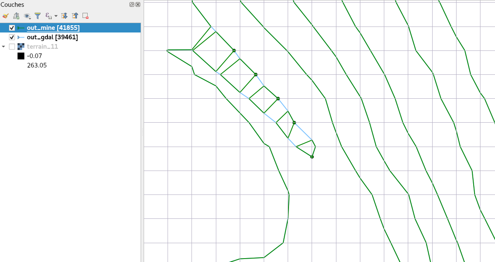
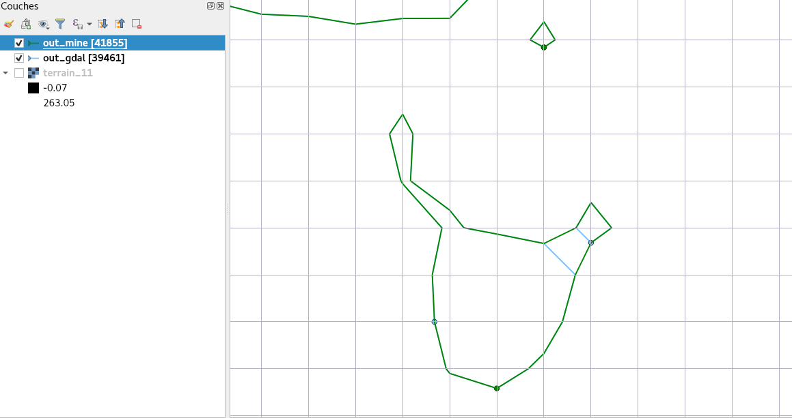

# gdal_contour_comparison

## Performances comparison

* Reference implementation (« gdal ») : gdal git commit b417a2ed57c5f4

* Compared implementations
  * « mine » : oslandia
  * "mine_altls": alternative linestring implementation (as a double std::vector of X and Y rather than a std::list of points)

* Raster : SRTM_36_03.tif

Command : 

```
gdal_contour -i 10 /data/gis/srtm/srtm_36_03.tif /data/gis/srtm/out_gdal.shp
```
      
|                  | mine   | mine_altls | gdal   | mine/gdal |
|------------------|--------|------------|--------|-----------|
| **time**         | 7.5s   | 16.5s      | 21.1s  | 0.35      |
| **nr. features** | 132748 | 132748     | 128529 | 1.03      |
| **RAM used**     | 91MB   | 86MB       | 88MB   | 1.03      |


The new implementation is then almost **3 times faster** than the initial one. It demands a very similar amount of RAM memory to execute (3% more).
The new implementation also generates a little bit more vector features (about 3% more)

### Valgrind/massif outputs

Mine
```
--------------------------------------------------------------------------------
Command:            /home/hme/src/gdal_gh/gdal/apps/.libs/gdal_contour -i 10 /data/gis/srtm/srtm_36_03.tif /data/gis/srtm/out_mine.shp
Massif arguments:   (none)
ms_print arguments: massif.out.13054
--------------------------------------------------------------------------------


    MB
90.85^                                                                       #
     |                                                                       #
     |                                                                 @     #
     |                                             @@@                 @::  :#
     |                               @             @                :::@:  ::#
     |                               @             @            :::::: @: :::#
     |                    : @@ ::::::@::           @           :::: :: @: :::#
     |                 :::::@ :: :: :@: ::: :: ::::@           :::: :: @: :::#
     |                @: :::@ :: :: :@: :: :: :: : @         :@:::: :: @: :::#
     |               @@: :::@ :: :: :@: :: :: :: : @        ::@:::: :: @: :::#
     |               @@: :::@ :: :: :@: :: :: :: : @  :: :::::@:::: :: @: :::#
     |              @@@: :::@ :: :: :@: :: :: :: : @  ::::: ::@:::: :: @: :::#
     |           :::@@@: :::@ :: :: :@: :: :: :: : @  ::::: ::@:::: :: @: :::#
     |         @@:: @@@: :::@ :: :: :@: :: :: :: : @  ::::: ::@:::: :: @: :::#
     |         @ :: @@@: :::@ :: :: :@: :: :: :: : @  ::::: ::@:::: :: @: :::#
     |       ::@ :: @@@: :::@ :: :: :@: :: :: :: : @  ::::: ::@:::: :: @: :::#
     |      @: @ :: @@@: :::@ :: :: :@: :: :: :: : @  ::::: ::@:::: :: @: :::#
     |     :@: @ :: @@@: :::@ :: :: :@: :: :: :: : @  ::::: ::@:::: :: @: :::#
     |  ::::@: @ :: @@@: :::@ :: :: :@: :: :: :: : @  ::::: ::@:::: :: @: :::#
     | @: ::@: @ :: @@@: :::@ :: :: :@: :: :: :: : @  ::::: ::@:::: :: @: :::#
   0 +----------------------------------------------------------------------->Gi
     0                                                                   18.56
```

GDAL
```
--------------------------------------------------------------------------------
Command:            gdal_contour -i 10 /data/gis/srtm/srtm_36_03.tif /data/gis/srtm/out_gdal.shp
Massif arguments:   (none)
ms_print arguments: massif.out.13275
--------------------------------------------------------------------------------


    MB
88.09^                                                                       #
     |                                                                       #
     |                                                                   @@  #
     |                                                                   @@ :#
     |                                                                @::@@::#
     |                     @                                       ::@@: @@::#
     |                 :   @       ::::                           :: @@: @@::#
     |               ::::@@@::::::::: :@::  :   :      :         ::: @@: @@::#
     |             ::: ::@ @: : :: :: :@: ::::::::::@@:::      @@::: @@: @@::#
     |            @: : ::@ @: : :: :: :@: : :: :::::@ ::::    :@ ::: @@: @@::#
     |          @@@: : ::@ @: : :: :: :@: : :: :::::@ :::::::::@ ::: @@: @@::#
     |        @@@ @: : ::@ @: : :: :: :@: : :: :::::@ ::::: :::@ ::: @@: @@::#
     |      ::@ @ @: : ::@ @: : :: :: :@: : :: :::::@ ::::: :::@ ::: @@: @@::#
     |      ::@ @ @: : ::@ @: : :: :: :@: : :: :::::@ ::::: :::@ ::: @@: @@::#
     |     :::@ @ @: : ::@ @: : :: :: :@: : :: :::::@ ::::: :::@ ::: @@: @@::#
     |   :::::@ @ @: : ::@ @: : :: :: :@: : :: :::::@ ::::: :::@ ::: @@: @@::#
     |  @: :::@ @ @: : ::@ @: : :: :: :@: : :: :::::@ ::::: :::@ ::: @@: @@::#
     | :@: :::@ @ @: : ::@ @: : :: :: :@: : :: :::::@ ::::: :::@ ::: @@: @@::#
     | :@: :::@ @ @: : ::@ @: : :: :: :@: : :: :::::@ ::::: :::@ ::: @@: @@::#
     | :@: :::@ @ @: : ::@ @: : :: :: :@: : :: :::::@ ::::: :::@ ::: @@: @@::#
   0 +----------------------------------------------------------------------->Gi
     0                                                                   103.3
```

## Behaviour comparison

On saddle points, the two implementations may have different behaviours.

(Illustrations made on another raster)

Legend : in green, « mine », in blue « gdal »








